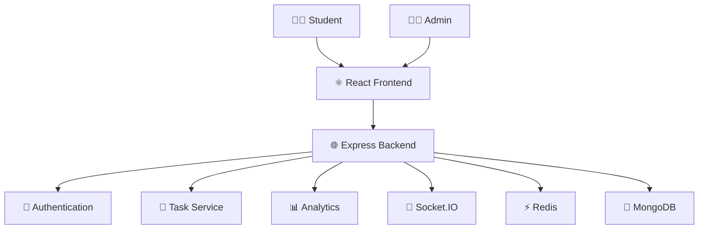
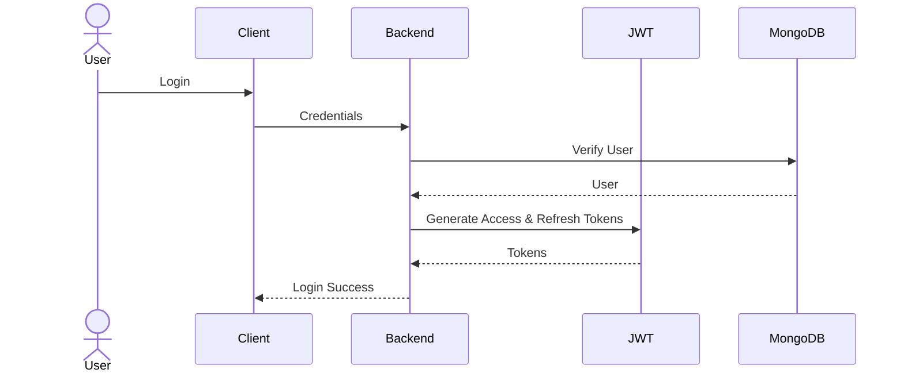
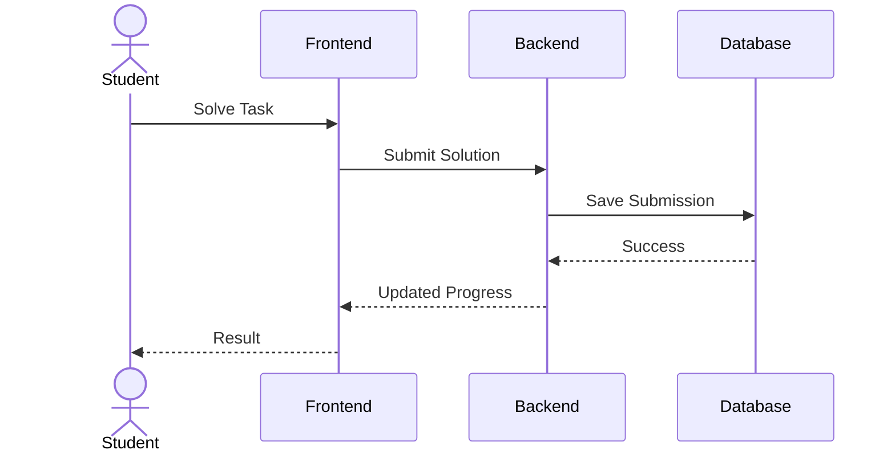
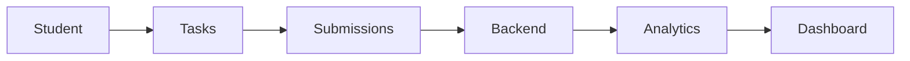

# 🚀 CodeTrack Pro

> A production-grade MERN-based Student Management & Coding Platform designed to streamline coding education through task management, analytics, authentication, real-time notifications, and role-based access control.

<p align="center">


</p>

---

# ✨ Features

### 👨‍🎓 Student Features

- Secure Authentication
- Student Dashboard
- Coding Playground
- Daily Coding Tasks
- Progress Tracking
- Streak System
- Submission History
- Real-Time Notifications
- Profile Management

---

### 👨‍🏫 Admin Features

- Student Management
- Task Management
- Analytics Dashboard
- Performance Monitoring
- Role-Based Access Control (RBAC)
- Announcement Management
- User Activity Tracking

---

### ⚙️ Backend Features

- JWT Authentication
- Refresh Token Rotation
- Secure Password Hashing
- Redis Caching
- Socket.IO Real-Time Events
- RESTful APIs
- Request Validation
- Error Handling Middleware
- Logging
- Modular Architecture

---

# 🏗️ Tech Stack

| Layer | Technologies |
|--------|--------------|
| Frontend | React.js, TypeScript, Tailwind CSS |
| Backend | Node.js, Express.js |
| Database | MongoDB |
| Cache | Redis |
| Authentication | JWT, Refresh Tokens |
| Real-Time | Socket.IO |
| Validation | Zod |
| Logging | Winston |
| Version Control | Git & GitHub |

---

# 🏛️ System Architecture



---

# 🔐 Authentication Flow



---

# 📚 Coding Task Flow



---

# 📊 Analytics Flow



---

# 📂 Project Structure

```text
CodeTrack-Pro
│
├── backend
│   ├── src
│   │   ├── config
│   │   ├── controllers
│   │   ├── middleware
│   │   ├── models
│   │   ├── routes
│   │   ├── services
│   │   ├── sockets
│   │   ├── utils
│   │   └── app.js
│   │
│   └── package.json
│
├── frontend
│   ├── src
│   │   ├── components
│   │   ├── pages
│   │   ├── hooks
│   │   ├── store
│   │   ├── services
│   │   └── App.tsx
│   │
│   └── package.json
│
└── README.md
```

---

# 🚀 Installation

Clone the repository

```bash
git clone https://github.com/premjohnson/codetrack-pro.git
```

Install Backend

```bash
cd backend

npm install
```

Install Frontend

```bash
cd frontend

npm install
```

---

# ⚙️ Environment Variables

```env
PORT=5000

MONGODB_URI=your_database_url

JWT_SECRET=your_secret

REDIS_URL=your_redis_url
```

---

# ▶️ Run the Project

Backend

```bash
npm run dev
```

Frontend

```bash
npm run dev
```

---

# 📡 Core APIs

## Authentication

```http
POST /api/auth/register

POST /api/auth/login

POST /api/auth/logout
```

---

## Students

```http
GET /api/students

POST /api/students

PUT /api/students/:id

DELETE /api/students/:id
```

---

## Tasks

```http
GET /api/tasks

POST /api/tasks

PUT /api/tasks/:id

DELETE /api/tasks/:id
```

---

## Analytics

```http
GET /api/analytics
```

---

# 🔒 Security

- JWT Authentication
- Refresh Token Rotation
- Password Hashing
- Input Validation
- RBAC Authorization
- Redis Session Management
- Secure API Design
- Environment Variable Protection

---

# 🛣️ Roadmap

- [ ] AI Code Review
- [ ] Contest Module
- [ ] Leaderboard
- [ ] Multi-language Code Execution
- [ ] Email Notifications
- [ ] Docker Deployment
- [ ] Kubernetes Support
- [ ] CI/CD Pipeline
- [ ] API Documentation (Swagger)

---

# 🤝 Contributing

Contributions are welcome!

Please read **CONTRIBUTING.md** before submitting a Pull Request.

---

# 📜 Code of Conduct

Please read **CODE_OF_CONDUCT.md**.

---

# 🔒 Security Policy

Please read **SECURITY.md**.

---

# 📄 License

Licensed under the MIT License.

---

# 👨‍💻 Author

**Prem Johnson**

GitHub: https://github.com/premjohnson

---

<p align="center">

⭐ If you like this project, please give it a star!

</p>
